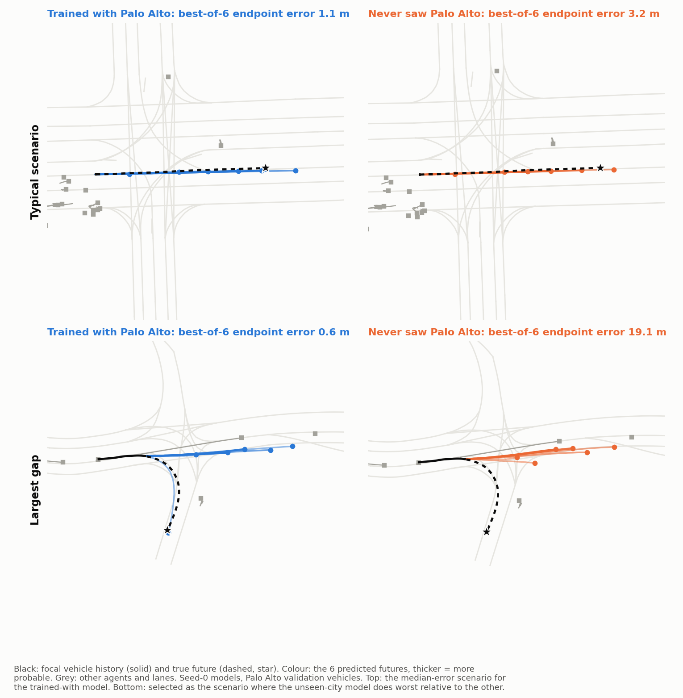
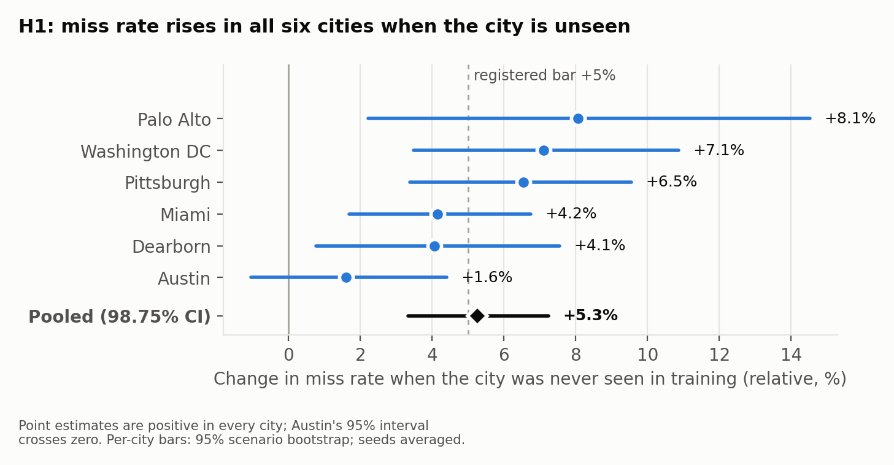
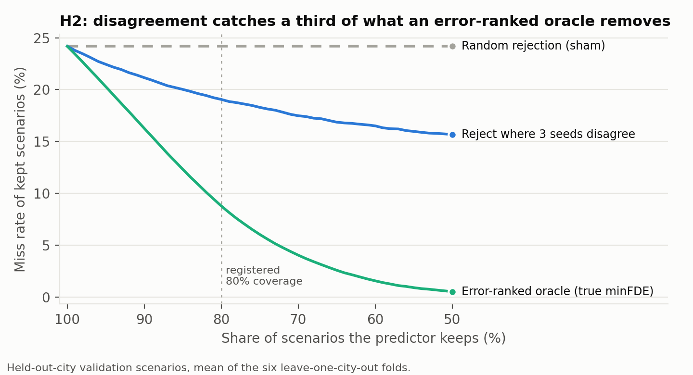
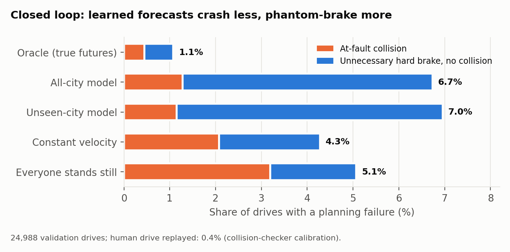
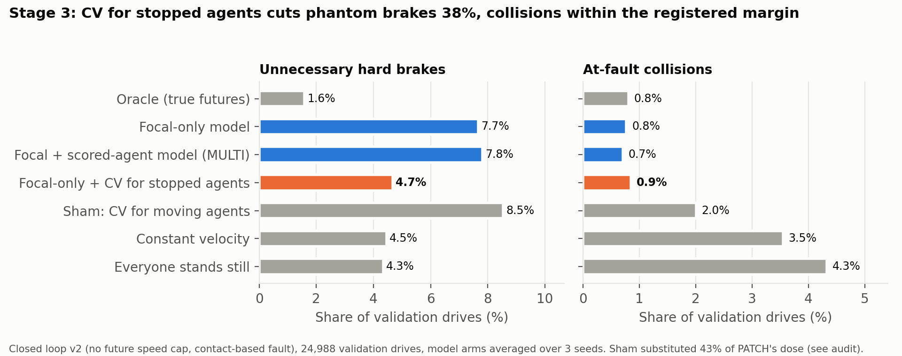
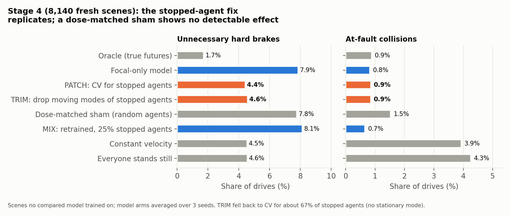
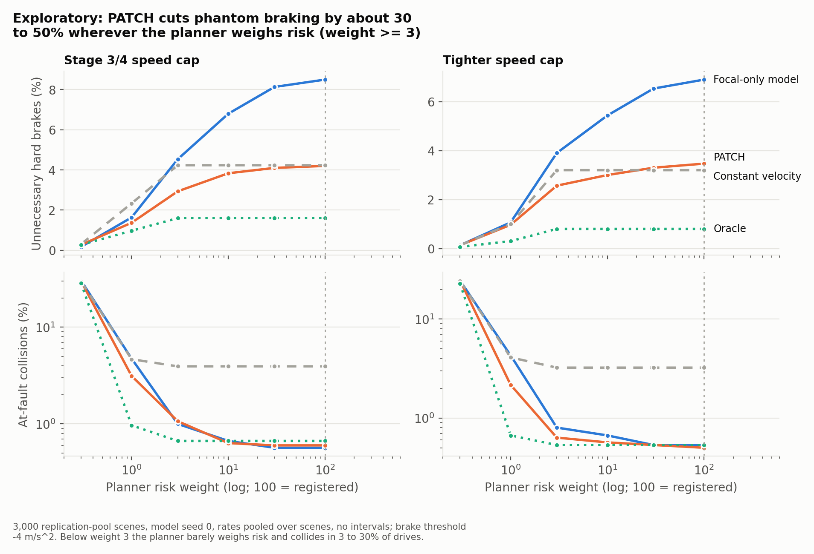

# City Shift

[](https://github.com/yusufdxb/av2-city-shift/actions/workflows/ci.yml)

<a href="https://youtu.be/X_JOo6AltDY"></a>

*21-second demo (YouTube). The scene, forecasts and planner decisions are real outputs of the seed-0 model on an Argoverse 2 scene.*

**A learned trajectory predictor that beats constant velocity on average made a planner phantom-brake for parked cars. This repo finds that failure, fixes it with a targeted forecast change, replicates the fix on fresh scenes against a dose-matched sham, and reports the fixes that failed.** A pre-registered study on the [Argoverse 2 motion forecasting dataset](https://www.argoverse.org/av2.html) (224,896 train and validation scenarios from six US cities; the unlabelled test split is not used), with a closed-loop planning test and a TensorRT deployment path.

## In brief

**The starting question.** Does a learned predictor get worse in a city it has never seen, and does that reach the car's driving? Barely: miss rate rises 5.3% [3.3, 7.2] (H1) and planning failures 4.3%, below the registered 10% bar (H4, dead). ([Results](#results))

**What it found instead.** Benchmarks score one focal agent per scene, chosen for being interesting, but the planner uses forecasts for up to 16 surrounding agents. On those 304,988 agents the learned model misses more often than constant velocity (0.424 vs 0.281), and on stopped ones, mostly parked cars, far more (0.52 vs 0.09): it predicts they will drive off, and the planner brakes for them. ([Stage 3a](#follow-up-studies-why-the-planner-phantom-brakes))

**The fix, replicated.** Giving stopped agents a constant-velocity forecast cut unnecessary hard brakes by **45%** [37.7, 51.4] on 8,140 scenes no compared model trained on, with collisions +0.04 pp [-0.14, +0.22], inside the registered +0.3 pp margin. A dose-matched sham (the same number of random agents, 99.99% of the dose) showed no detectable reduction, so targeting stopped agents is what matters. ([Stage 4](#stage-4-independent-dose-matched-replication))

**What did not work.** Retraining on all scored agents cut the stopped-agent miss rate by 0.48 but left braking unchanged (-1.1%): the planner weighs risk at 100x probability, and the retrained model still gives about a quarter of parked cars more than 5% probability of moving (exploratory). A 75/25 focal and stopped-agent training mix also failed (2.7% more brakes). Both cost focal accuracy. A forecast can be right by the benchmark and still make the planner brake.

**Where the evidence stops.** The closed loop is a privileged harness: speed-only planning along the human's route, with other agents replaying their logs. A replay of every Stage 4 drive shows that 77 to 84% of at-fault collisions happen after the car has passed the end of the human's logged route, so the collision margin mostly measures that extension. Scored only on the route, the brake cut is 68% [63, 72], but there the registered collision control fails (the stand-still forecast collides only 1.6x as often as the model, against 5.2x over the full drive), so route-only collision results are weak evidence. On the same scenes, in a stop-line harness with route exceedance below 1e-6 m ([diagnostics](reports/followups/study_e_stopline_diagnostics.json)), the braking result holds over full drives (70% [66, 73], 37 pp beyond a dose-matched sham), while no arm collides more often than the replayed human drive does (exploratory). ([Limitations](#limitations))

**Engineering.** Under the fix, stopped agents need no model call: 63% fewer agents go through inference, decisions are identical at all 3,000 test replans, and the TensorRT FP16 replan is 14% faster. The numpy planner, 69% of replan time, is the bottleneck, not the model. ([Deployment](#deployment))

**How it was run.** 13 hypotheses in five pre-registrations, each committed before its own scoring, 28 training runs (22 for Stages 1 and 2, three for Stage 3, three for Stage 4), and every registered decision re-derived by an independent script from the released per-row tables. Negative results are reported with the same weight as positive ones. ([Audit trail](#audit-trail))

The rest of this page is the full study in the order it was run: [the questions](#the-questions), [design](#design), [model](#model), [closed-loop test](#closed-loop-test-stage-2), [deployment](#deployment), [results](#results), [follow-up studies](#follow-up-studies-why-the-planner-phantom-brakes), [what broke](#what-broke-along-the-way), [limitations](#limitations), [audit trail](#audit-trail), [reproduce](#reproduce).

## The questions

| | Question | Primary measure | Pre-set bar |
|---|---|---|---|
| **H1** | Is the predictor less accurate in an unseen city? | Miss rate (best of 6 endpoints > 2 m) on city *c*, model trained without *c* vs an equal-size model trained with it | at least +5% relative, pooled over 6 folds |
| **H2** | Does the model know which predictions are wrong there? | Share of oracle-removable misses caught by rejecting the 20% of scenarios where 3 seeds disagree most | capture fraction > 0 (useful at 0.25) |
| **H3** | Does that self-knowledge survive the shift? | Capture fraction, unseen city minus seen cities | two-sided, no direction registered |
| **H4** | Does the accuracy loss reach driving outcomes? | Planner failure rate (at-fault collision or unnecessary hard brake) using the unseen-city vs all-city predictor | at least +10% relative |
| **H5** | Does the model beat a same-data map baseline on the agents the planner uses? | Miss rate vs lane following, planner-relevant agents | at least 10% lower |
| **H6** | Is there a stopped-agent failure? | Miss rate vs constant velocity: stopped (a) and moving (b) non-focal planner agents | (a) at least +0.15 worse; (b) at least 30% better |
| **H7** | Does training on focal plus scored agents fix the phantom braking? | Unnecessary hard brakes, focal + scored-agent model (MULTI) vs focal-only, closed loop v2 | at least 30% fewer, collisions within +0.3 pp |
| **H8** | Does constant velocity for stopped agents fix it? | Same, focal-only model with CV for stopped agents | at least 30% fewer, collisions within +0.3 pp |
| **H9** | Does the focal + scored-agent model fix the open-loop error without hurting focal agents? | Miss rate, stopped non-focal and focal agents | at least 0.15 lower; focal no worse than +0.02 |
| **H10** | Does the stopped-agent fix replicate on fresh scenes? | Unnecessary hard brakes, PATCH vs focal-only, 8,140 unused training scenes | at least 30% fewer, collisions within +0.3 pp |
| **H11** | Is it specific to stopped agents? | PATCH's reduction minus a dose-matched sham's (same number of random agents) | at least 20 pp larger |
| **H12** | Is removing moving-mode probability enough? | TRIM (drop stopped agents' moving modes) vs focal-only | at least 30% fewer, collisions within +0.3 pp |
| **H13** | Can a retrained model do it? | MIX (75% focal, 25% stopped-agent samples) vs focal-only; focal miss rate | at least 30% fewer brakes, collisions within +0.3 pp, focal no worse than +0.02 |

Pre-registrations, including every deviation and the reason for it:
[Stage 1](docs/preregistration/stage1-city-shift.md) (H1 to H3),
[Stage 2](docs/preregistration/stage2-closed-loop.md) (H4),
[Stage 3a](docs/preregistration/stage3a-baselines.md) (H5, H6) and
[Stage 3](docs/preregistration/stage3-closed-loop-fix.md) (H7 to H9) and [Stage 4](docs/preregistration/stage4-replication.md) (H10 to H13). Stages 3a, 3 and 4 were registered and pushed publicly after the Stage 1 and 2 results, in response to a review, and before any of their own validation scoring.

## Design

**Leave one city out.** For each of the six cities (Austin, Dearborn, Miami, Palo Alto, Pittsburgh, Washington DC), a model is trained on the other five. Its comparator is a model trained on all six. Both see the same number of training scenarios (128,000) for the same number of steps, and both are scored on the *same* validation scenarios from the held-out city, so they differ only in whether that city was in training and in the random draw of training scenarios (which the three seeds vary). Three seeds per arm; the seeds vary both initialisation and the training-sample draw.

| Arm | Role | Runs |
|---|---|---|
| LOCO-*c* | treatment: trained without city *c* | 6 cities x 3 seeds |
| ALL | control: trained on all six cities, same size | 3 seeds |
| NOMAP | positive control: map input removed, must be clearly worse | 1 |
| Random rejection | sham for H2, rejects the same 20% dose | analysis only |
| Oracle rejection | reference for H2: rejects the 20% with the largest true error (seed-averaged minFDE) | analysis only |

**Statistics.** Pooled effects are means over the six city folds. Each hypothesis is decided by a scenario-level paired bootstrap CI (10,000 draws, resampling within each city) at the Bonferroni level for the four-hypothesis family, 98.75%, together with its magnitude bar. An exact sign-flip test over folds is reported as fold consistency only: with six folds its two-sided floor is 2/64 = 0.031, which no multiplicity correction over four tests can pass. The registration originally used that test with Holm correction; the error was caught by an external code review before any confirmatory scoring and is recorded as deviation 3.

## Model

A 1.44M-parameter query-based transformer, small enough to train in about 35 minutes on a single desktop GPU:

- **Agents:** up to 32 agents, 5 s of history each, encoded by a temporal 1D convolution. Everything is expressed in the focal agent's frame.
- **Map:** up to 128 lane centerlines and crosswalks, each resampled to 20 points and encoded with a PointNet.
- **Scene encoder:** 3 pre-LN transformer layers over all agent and map tokens.
- **Decoder:** 6 learned mode queries cross-attend to the scene, and each emits a 6 s trajectory and a probability.
- **Training:** winner-takes-all regression plus mode classification, AdamW with a cosine schedule, bf16 autocast.

Pilot model on a held-out development slice of the training split (not the validation split, not a study result; source: [`reports/pilot/dev_metrics.json`](reports/pilot/dev_metrics.json)):

| minADE (m) | minFDE (m) | Miss rate | brier-minFDE |
|---|---|---|---|
| 0.929 | 1.555 | 0.223 | 2.179 |

For context only: the Argoverse 2 paper's strongest baseline, WIMP, reports minFDE 2.90 and miss rate 0.42 at K=6 on vehicles, and 2022 leaderboard entries report brier-minFDE 1.92 to 2.16 on the test set. These are different splits and agent mixes, so the comparison is indicative, not a benchmark claim.

## Closed-loop test (Stage 2)

Open-loop accuracy cannot say whether an error matters: a 3 m miss on a car 80 m away changes nothing, a 1 m miss on a car cutting in changes everything. Stage 2 puts the predictor in a loop:

1. At 5 s the self-driving car's own logged track is handed to a planner. The other agents replay their logs and do not react.
   **The planner is privileged by design:** it follows the human driver's *future* path and its speed is capped at the human's future maximum speed plus 1 m/s. It only chooses how fast to go along that path. This makes Stage 2 a paired sensitivity test of one planner to its forecasts, not a general driving benchmark.
2. Every second, the planner forecasts up to 16 nearby agents, ranked by how close they come to the car's route. It picks one of 11 constant-acceleration speed profiles along the car's logged path and executes it for 1 s.
3. The drive is scored against where every agent actually went. The outcomes are an at-fault collision (exact oriented-box overlap, agent ahead of the car) or an unnecessary hard brake (at or below -4 m/s² when the human driver never braked that hard).

Development-slice numbers for every control are in [`reports/pilot/stage2_dev_summary.json`](reports/pilot/stage2_dev_summary.json). Controls: an oracle planner given the true futures (ceiling), constant-velocity and "everyone stands still" forecasts (floors, and a positive control), and a replay of the human's own drive (collision-checker calibration, must be below 1%).

## Deployment

The model exports to ONNX and TensorRT. The gate compares engines against a true FP32 reference on 2,000 validation scenarios, using the confirmatory all-city seed-0 model on an idle desktop GPU (source: [`reports/confirmatory/deploy_report.json`](reports/confirmatory/deploy_report.json)):

| | minFDE change | Miss rate change | Batch 1 (p50) | Batch 32 (p50) |
|---|---|---|---|---|
| PyTorch FP32 | reference | reference | 1.32 ms | 3.35 ms |
| TensorRT FP32 | 0.0% (paths within 0.14 mm) | 0.0% | 0.59 ms | 1.97 ms |
| TensorRT FP16 | +0.13% | -0.64% | 0.39 ms | 0.97 ms |

Gate: pass (FP32 within 1 cm; FP16 within 1% on minFDE and miss rate). The FP16 aggregate barely moves, but the largest single-coordinate difference across the 2,000 scenes is 1.45 m, on one mode of one scene. The latency figures time the predictor alone, not the closed-loop serving path (scene building and planning run on the CPU). FP16 is 3.4x faster than PyTorch at batch 1 and 3.5x at batch 32.

**The whole serving path, not just the model** ([report](reports/serving/serving_report.json)): one closed-loop replan (select agents, build inputs, batch up to 16 agents into one inference, plan), measured over 23,988 replans of 3,998 development-slice drives on an otherwise idle GPU. Median milliseconds per replan:

| | PyTorch FP32 | TensorRT FP32 | TensorRT FP16 |
|---|---|---|---|
| Inference | 2.08 | 1.29 | 0.79 |
| Input building (CPU) | 1.07 | 1.06 | 1.05 |
| Planning (CPU, numpy) | 5.35 | 5.33 | 5.33 |
| End to end | 9.10 | 8.26 | 7.78 |

TensorRT FP16 makes inference 2.6x faster but the replan only 1.17x faster: the numpy planner is about 69% of the time, so it, not the model, is the next thing to optimise. FP16 changes the chosen acceleration in 1.8% of replans and the final outcome (collision or unnecessary hard brake) in 0.48% of drives (19 of 3,998). Once a decision diverges, later inputs differ too, so the largest per-agent trajectory differences in the report (up to 26.6 m on one mode) include that closed-loop drift and are not pure FP16 rounding.

**Serving the fix** ([report](reports/serving/serving_policies_report.json)): the same benchmark with the forecast policies from Stages 3 and 4 inserted before planning (closed loop v2 scoring). Because PATCH replaces stopped agents' forecasts with constant velocity anyway, those agents can skip the model entirely; that cut the agents sent to inference from 293,134 to 109,357 (63% fewer). Median milliseconds per replan:

| Policy | PyTorch FP32 | TensorRT FP16 |
|---|---|---|
| None (focal-only model) | 9.01 | 7.72 |
| PATCH | 9.02 | 7.73 |
| PATCH, stopped agents skip inference | 7.73 | 6.66 |
| TRIM | 9.05 | 7.76 |

The fix is free, and served with skipped inference it makes the TensorRT FP16 replan 14% faster. Under PATCH, TensorRT FP16 and PyTorch FP32 disagree on the final outcome of 3 of 3,998 drives (0.075%), against 19 (0.48%) without it. Planning (5.3 ms) remains the bottleneck.

## Results

All numbers are on the 24,988 validation scenarios; per-arm outcomes average the three seeds. Source files: [`reports/confirmatory/`](reports/confirmatory/).

| | Result | 98.75% CI | Fold consistency | Registered verdict |
|---|---|---|---|---|
| **H1** accuracy gap (miss rate, unseen vs seen city) | **+5.3%** relative | [+3.3%, +7.2%] | 6/6 folds positive (p = 0.031, floor) | supported: CI excludes 0 and point estimate clears the +5% bar, but the CI's lower end does not |
| **H2** capture fraction of ensemble disagreement, unseen city (vs error-ranked oracle) | **0.333** (random rejection: 0.000) | [0.311, 0.356] | 6/6 folds (p = 0.016, floor) | supported, above the 0.25 useful bar |
| **H3** capture fraction, unseen minus seen cities | +0.005 | [-0.018, +0.030] | p = 0.56 | no detectable difference |
| **H4** planning-failure rate, unseen-city vs all-city predictor | **+4.3%** relative | [+0.1%, +9.1%] | 4/6 folds positive (p = 0.22) | **dead**: CI excludes 0, but the point estimate is below the +10% bar |
| PC1 no-map model | miss rate 0.355 vs 0.228 (+56%) | | | pass (needs +10%) |
| PC2 map-swap val set | miss rate 0.635 vs 0.228; disagreement AUROC 0.63 | | | pass (needs +10%, AUROC > 0.6) |
| PC3 "everyone stands still" planner | collisions 3.2% vs 1.3% | | | pass (needs 2x) |
| Collision-checker calibration (human drive replayed) | 0.42% at-fault collisions | | | pass (needs < 1%) |

The fold-consistency p-values sit at the 6-fold floor and are descriptive only; decisions use the Bonferroni-level bootstrap CI (see Statistics).





**H1 by city** (miss rate, all-city model vs the model that never saw the city):

| City | Scenarios | Seen | Unseen | Relative change |
|---|---|---|---|---|
| Austin | 5,324 | 0.239 | 0.243 | +1.6% |
| Dearborn | 3,066 | 0.265 | 0.275 | +4.1% |
| Miami | 6,654 | 0.224 | 0.234 | +4.2% |
| Palo Alto | 1,413 | 0.220 | 0.237 | +8.1% |
| Pittsburgh | 5,329 | 0.204 | 0.217 | +6.5% |
| Washington DC | 3,202 | 0.229 | 0.245 | +7.1% |



**Closed loop, pooled over all validation scenarios:**



| Planner forecasts from | Failure | At-fault collision | Unnecessary hard brake | Distance vs human |
|---|---|---|---|---|
| Oracle (true futures) | 1.1% | 0.4% | 0.7% | 1.76x |
| All-city model | 6.7% | 1.3% | 6.0% | 1.45x |
| Unseen-city model | 7.0% | 1.2% | 6.2% | 1.46x |
| Constant velocity | 4.3% | 2.1% | 2.4% | 1.71x |
| Everyone stands still | 5.1% | 3.2% | 2.4% | 1.57x |
| Human drive replayed | 0.4% | 0.4% | n/a | 1.00x |

### Exploratory findings (not registered, labelled permanently)

- **Knowing it is wrong is not knowing it is somewhere new.** No uncertainty signal meaningfully separates unseen-city scenarios from seen-city ones (mean AUROC 0.505 to 0.518 across the four signals, chance is 0.5), even though ensemble disagreement ranks that city's errors with no detectable difference from the seen cities (H3; not a proof of equivalence).
- **Mode spread and ensemble disagreement catch a similar share of misses.** Scoring each model's own mode spread against its own errors gives the same point estimate in the unseen city as ensemble disagreement (capture fraction 0.333 vs 0.333; no paired test of the difference was run), at a third of the inference cost. (An earlier version of this line reported 0.40; that figure averaged the spread across the three seeds, which is itself an ensemble, and was corrected after a review.) Mode entropy (0.24) and Mahalanobis distance of the scene embedding (0.17) are weaker.
- **The learned predictor phantom-brakes.** It collides less than constant velocity (1.3% vs 2.1%) but fails more overall (6.7% vs 4.3%), because the registered planner brakes for any predicted mode that crosses its path, even at a few percent probability. The unseen-city predictor's extra failures are extra hard brakes (6.2% vs 6.0%), not collisions (1.2% vs 1.3%). The planner was deliberately not retuned after this was first seen on development data.

## Follow-up studies: why the planner phantom-brakes

A review asked two things: how the model compares with simple baselines on the same data, and how accurate the forecasts the planner actually consumes are (Stage 1 scored only the focal agent; the planner forecasts up to 16 surrounding agents). A development-slice smoke test answered the second question in an unexpected way, and the finding was registered as H6 before any validation scoring.

**Stage 3a** (2.87M agent forecasts on validation; decisions by 98.75% scenario-cluster bootstrap; [results](reports/stage3a/results.json)):

| | Result | 98.75% CI | Verdict |
|---|---|---|---|
| **H5** model vs lane following, planner agents | 3.3% fewer misses | [1.9%, 4.6%] | killed (bar 10%) |
| **H6a** stopped non-focal agents, model minus constant velocity | **+0.43** miss rate (0.52 vs 0.09; 4.7x to 6.5x worse in every city) | [+0.424, +0.436] | supported |
| **H6b** moving non-focal agents, model vs constant velocity | **57% fewer misses** | [56.1%, 57.5%] | supported |

**All planner-relevant agents, one snapshot at the t=49 handoff** (descriptive, all 304,988 agents; [results](reports/stage3a/results.json), `descriptive_tables`, set `planner_relevant`, stratum `arm`):

| Forecast | minADE (m) | minFDE (m) | Miss rate | brier-minFDE |
|---|---|---|---|---|
| All-city model (ALL) | 0.94 | 2.36 | 0.424 | 2.93 |
| Unseen-city model (LOCO) | 0.94 | 2.39 | 0.431 | 2.98 |
| Constant velocity | 1.24 | 2.62 | 0.281 | 3.34 |
| Lane following | 2.01 | 3.93 | 0.440 | 4.23 |
| Everyone stands still | 6.41 | 12.44 | 0.397 | 12.44 |

The learned model has lower mean errors than constant velocity but a higher miss rate on the agents the planner uses. H6 splits the non-focal agents by whether they are stopped or moving. Stopped agents are mostly parked cars; 39.5% of them leave the scene or lose tracking within 6 s and are scored at their last observed point.

Why this likely happens: 13.1% of training focal agents (26,233) are stopped at the prediction time, and only 15.6% of those (4,101) end the next 6 s within 2 m of where they stopped (15.5%, 4,065, stay within 2 m the whole time), so a model trained on them can learn that stopped means about to move. That fits the H6 pattern (right on focal agents, wrong on non-focal stopped ones), but no experiment here isolates it as the cause.

**Stage 3** is a sequential follow-up on the same 24,988 validation scenes that Stage 3a had already scored. It was registered after Stage 3a's results were known, so it is not an independent confirmation. It tested two fixes in a less privileged closed loop (no future speed cap, contact-based at-fault attribution), with 99.17% CIs across six comparisons ([results](reports/stage3/results.json)):



| | Result | 99.17% CI | Verdict |
|---|---|---|---|
| **H7** focal + scored-agent model (MULTI; same recipe, 128,000 samples drawn from 763,037 eligible fully observed focal and SCORED training tracks): fewer unnecessary hard brakes | -1.1% (no reduction) | [-6.3%, +3.6%] | killed |
| **H8** focal-only model with CV forecasts for stopped agents: fewer unnecessary hard brakes | **38.4% fewer** | [34.1%, 42.4%] | supported |
| H8 collision change (non-inferiority margin +0.3 pp) | +0.09 pp | [-0.03, +0.20] pp | passes |
| **H9** MULTI, stopped non-focal miss rate | **-0.48** | [-0.490, -0.479] | passes |
| H9 MULTI, focal miss rate (must be within +0.02) | +0.06 (0.288 vs 0.228) | [+0.056, +0.067] | fails, so H9 killed |

Controls: the stand-still forecast collides 5.6x as often as the model (pass); the replayed human drive has 0.35% at-fault collisions under the new rule (pass).

**Honest caveat on the sham.** The dose-matched sham gives constant-velocity forecasts to randomly chosen *moving* agents. Because the planner's agent set is dominated by parked cars, it could only reach 43% of PATCH's dose ([audit](reports/stage3/audit_dose.json), deviation 3). The sham increased braking (-12.4%) and collisions (+1.2 pp), the opposite of PATCH, which supports a stopped-specific effect by direction, but it is not a matched comparison. PATCH also changes both the forecast trajectory and its probability. Together with H6, H8 points to how stopped agents' forecasts enter the planner, but Stage 3 does not isolate focal-selection bias as the only cause. Stage 4 below repeated this with a properly dose-matched sham on fresh scenes.

**Exploratory, not registered** ([numbers](reports/stage3/exploratory_moving_mode_mass.json), development slice): why does retraining fix the open-loop error but not the braking? On stopped non-focal agents the focal-only model puts 95% of its probability on moving modes; the focal + scored-agent model (MULTI) puts 10%. But about a quarter of truly parked cars still get more than 5% probability on a moving mode, and the registered planner weights risk at 100x probability, so a 5% mode crossing its path outweighs the whole progress term. The PATCH arm sets that probability to exactly zero. Best-of-6 miss rate cannot see this: a forecast can be "right" by the benchmark and still make the planner brake.

### Stage 4: independent, dose-matched replication

Stage 3 reused already-scored validation scenes and its sham reached only 43% of PATCH's dose. Stage 4 fixed both: it ran on **8,140 training scenes that no compared model trained on** (outside all three focal-only training draws and the development slice; MIX excluded them too), and its sham gave constant-velocity forecasts to a uniformly random subset of selected agents of exactly PATCH's size at every replan. The realised sham dose was **99.99%** of PATCH's (0.05% of replans capped where the arms' paths diverged). Decisions use 99.375% intervals (eight components) ([results](reports/stage4/results.json)):



| | Result | 99.375% CI | Verdict |
|---|---|---|---|
| **H10** PATCH vs focal-only: unnecessary hard brakes | **44.9% fewer** | [37.7%, 51.4%] | supported |
| H10 collisions (margin +0.3 pp) | +0.04 pp | [-0.14, +0.22] pp | passes |
| **H11** PATCH minus dose-matched sham | **41.0 pp** larger reduction (sham alone: 3.9% fewer brakes, interval from 5.4% more to 12.1% fewer, no detectable reduction) | [32.8, 50.2] pp | supported |
| **H12** TRIM (drop stopped agents' moving modes) vs focal-only | **43.1% fewer** | [36.0%, 49.5%] | supported |
| H12 collisions | +0.05 pp | [-0.13, +0.22] pp | passes |
| **H13** MIX (75% focal, 25% stopped non-focal samples) vs focal-only | 2.7% *more* brakes | [-12.1%, +5.1%] | killed |
| H13 focal miss rate (must be within +0.02) | +0.013 (0.236 vs 0.223) | [+0.005, +0.022] | fails |

Controls: the stand-still forecast collides 5.2x as often as the model; the replayed human drive has 0.38% at-fault collisions; 640 seed-averaged brake events in the control arm (floor 100).

**Caveat on TRIM.** For about 67% of stopped agents the model had no mode that stays within 2 m, so TRIM fell back to constant velocity. TRIM is therefore mostly PATCH: H12's result does not show whether dropping moving-mode probability alone is enough on the agents where the model has a stationary mode (no arm without the fallback was run), and it is weak evidence that probability mass, rather than the trajectory, is the mechanism. An exploratory follow-up (study A, below) ran that missing arm.

**Descriptive only: per-replan risk calibration** (first three replans, which have a full 4 s future; contacts are rare, so Brier scores are small). On stopped agents, PATCH and TRIM halve the planner's risk error (Brier 0.0018 to 0.0009) but rank risky agents worse (AUROC 0.67 to 0.55 and 0.56); the oracle reaches 0.86. The fix works by removing false alarms, not by predicting real conflicts better.

### Exploratory: where the phantom brakes come from, decision by decision

Not registered; run after Stage 4 on 1,500 of the replication-pool scenes with the focal-only model (seeds 0, 1 and 2) and the registered planner ([script](src/cityshift/mechanism.py), [summary](reports/mechanism/mechanism_audit.json), per-decision and per-agent rows in release v1.4). At each replan where the planner *chose* a hard acceleration (-4 m/s^2 or harder) instead of the plan it would pick with no risk term (166, 170 and 119 replans for the three seeds), it lists the agents that carry predicted risk on that rejected plan and checks each against its true logged future with the planner's own look-ahead test (4 s, 0.5 m margin). A second cohort keeps only the brakes the registered outcome counts (the executed 1 s speed change reaches -4 m/s^2 while the logged human never brakes that hard); every such brake in these scenes (141, 141 and 103) is in the first cohort. The conflict test counts near misses, which loosens it, but it scores unobserved future steps as no conflict and uses agent boxes rather than exact contact, so the true-conflict shares are approximate, not bounds. Intervals are 95%, resampling scenes, seed 0.

| At a phantom-brake decision (seed 0 [95% CI]; seeds 1 and 2) | Commanded brakes | Realised brakes (seed 0) |
|---|---|---|
| At least one blocking agent was stopped | 76% [69, 82]; 74%, 76% | 75% |
| Share of all blocking risk carried by stopped agents | 56% [48, 64]; 55%, 52% | 58% |
| Share of stopped agents' risk from the model's moving modes (risk-weighted) | 90% [84, 95]; 87%, 95% | 88% |
| Stopped blockers that truly conflict with the rejected plan, by count | 5.8% [2.6, 9.8]; 8.1%, 8.8% | 6.0% |
| Same, weighted by predicted risk | 17% [8, 26]; 27%, 22% | 18% |
| Moving blockers that truly conflict, by count | 23% [15, 32]; 20%, 25% | 18% |
| Brake decisions with any truly conflicting blocker | 20% [14, 27]; 20%, 25% | 18% |
| Brakes that PATCH removes at that same replan | 66% [58, 74]; 65%, 63% | 65% |
| ...when every blocker is stopped | 96% [91, 100]; 95%, 95% | 96% |

So at these decisions about half of the risk that rules out the faster plan (48 to 51% across seeds) is probability the model puts on stopped agents moving. By count, those stopped agents rarely conflict with that plan in their true futures (6 to 9%); weighted by risk it is 17 to 27%, so the stopped agents the model is most worried about are more often real conflicts. The pattern is the same for realised brakes and across three model seeds. This is association at the decision, not proof that each listed agent caused the brake (an agent can carry risk without being decisive); the PATCH counterfactual, which removes about two thirds of these brakes, is the stronger evidence. Re-running scene by scene reproduces the registered Stage 4 brake outcome on 1,499, 1,498 and 1,500 of the 1,500 scenes; the few differences are borderline choices one acceleration step apart.

**Skipping inference is exactly equivalent** ([script](scripts/parity_patch_skip.py), [result](reports/serving/parity_patch_skip.json)): on 500 development scenes, PATCH with stopped agents skipping the model chose the same acceleration as PATCH at all 3,000 replans and produced identical outcomes in all 500 drives, while sending 63% fewer agents through the model.

### Exploratory: does the fix depend on this planner's settings?

Not registered; run after Stage 4 on 3,000 of the replication-pool scenes with all three model seeds ([script](src/cityshift/sensitivity.py), [summary](reports/sensitivity/summary.json), per-row tables in release v1.4). The sweep re-ran the closed loop with the planner's risk weight at 0.3, 1, 3, 10, 30 and 100 (100 is registered), two speed caps (the Stage 3/4 cap and a tighter one), and three hard-brake definitions (-3, -4 and -5 m/s^2). The focal-only and PATCH arms use model seeds 0, 1 and 2; constant velocity and the oracle use no model and come from the seed-0 run. At the registered settings the seed-0 run reproduces the Stage 4 rows exactly (0.0 difference on every arm and metric). Intervals are unadjusted 95% scenario-cluster bootstrap intervals (10,000 draws, seeds averaged within each scene), with no correction across the 36 configurations. Where the focal-only arm brakes so rarely that some draws contain no brakes, the reduction is undefined in those draws and its interval covers only the defined ones; summary.json flags these (`ci95_over_defined_draws_only`) with the undefined share, which only happens at weight 0.3: 0.01% and 0.3% of draws in the table below (Stage 3/4 and tighter cap), and up to 13% at -5 m/s^2.



| Risk weight | PATCH's cut in phantom braking at -4 m/s^2, pooled over scenes: Stage 3/4 cap; tighter cap | Collisions, PATCH minus focal-only (pp): Stage 3/4 cap; tighter cap |
|---|---|---|
| 0.3 | -35% [-140, 21]; -30% [-250, 38] (noise: 0.1 to 0.3% of drives brake) | -0.42 [-0.78, -0.08]; +0.06 [-0.26, 0.38] (every arm collides in 23 to 30%) |
| 1 | 12% [-6, 28]; -6% [-35, 17] | -1.51 [-2.01, -1.01]; -1.83 [-2.33, -1.34] |
| 3 | 30% [20, 39]; 22% [11, 32] | +0.04 [-0.19, 0.28]; -0.12 [-0.32, 0.08] |
| 10 | 42% [34, 50]; 43% [34, 50] | -0.02 [-0.22, 0.19]; -0.11 [-0.28, 0.06] |
| 30 | 45% [38, 52]; 48% [41, 55] | -0.03 [-0.23, 0.17]; -0.09 [-0.26, 0.08] |
| 100 (registered) | 46% [39, 53]; 50% [42, 56] | 0.00 [-0.19, 0.20]; -0.07 [-0.22, 0.09] |

At risk weights of 10 and above, PATCH cuts phantom braking by 30 to 50% pooled over scenes under every speed cap and brake definition (lowest interval bound 18%, at -5 m/s^2), and each of the three model seeds shows a cut of at least 25%. Collision differences there are all within 0.12 pp, with intervals that include zero. At weight 3 the cut is smaller and depends on the definition: 22 to 30% at -3 and -4 m/s^2, but not detectable at -5 m/s^2 (8% [-8, 22] and 3% [-18, 21]), where seeds 1 and 2 are negative (-19% to -2%). The seed-0-only version of this sweep (release v1.3) had reported about 30 to 50% from weight 3 up; the extra seeds show that seed 0 was the most favourable of the three at weight 3. At weight 1 PATCH brakes less only under the loosest definition (12% [4, 20] and 16% [3, 27] at -3 m/s^2), but it collides 1.5 to 1.8 pp less under both caps (intervals exclude zero). At weights of 30 and above PATCH brakes about as rarely as constant velocity while colliding about 6x less (0.5 to 0.6% vs 3.2 to 3.9%). The sweep also quantifies how privileged the harness is: at the registered settings 82% of focal-only drives and 95% of PATCH drives end past the end of the human's logged route, on its straight extension.

### Exploratory, pre-registered follow-ups: stopped agents that move off, the route end, TRIM without fallback, a stop-line harness

Pre-registered before any analysis ([registration](docs/preregistration/exploratory-followups.md)), but after Stage 4, so it cannot change a registered verdict. The closed loop is deterministic given the six executed accelerations stored in the Stage 4 table, so [`replay.py`](src/cityshift/replay.py) rebuilds all 146,520 Stage 4 drives on the CPU and reproduces every stored outcome exactly ([parity](reports/followups/replay_parity.json)), then rescores them ([script](scripts/analyze_followups.py), [summary](reports/followups/summary.json)). Same estimator as Stage 4 (seeds averaged per scene, cities equal-weighted, 10,000 within-city bootstraps), 95% intervals.

- **No detected increase in collisions with stopped agents that later move off.** Agents stopped at the handoff that later move more than 2 m are where a constant-velocity forecast for stopped agents could backfire. At-fault collisions with them: 0.14% of focal-only drives and 0.14% of PATCH's, a difference of -0.02 pp [-0.08, +0.04], inside the +0.3 pp non-inferiority margin; the interval still allows an increase of about 28% relative to focal-only, and there are only about 11 such collisions per learned arm (seed-averaged). The check can see this failure when it exists: the stand-still forecast, which assumes every agent stays put, adds +0.59 pp [+0.39, +0.82], and constant velocity for every agent adds +0.35 pp [+0.18, +0.55].
- **On the logged route PATCH's braking cut is larger, and most collisions happen past the route's end.** Scored only until either drive of a focal-only/PATCH pair passes the end of the human's logged route (median 4.2 s after the handoff; 22% of pairs have no complete 1 s segment), PATCH cuts unnecessary hard brakes by 68% [63, 72] (registered full window: 45%), with collisions -0.02 pp [-0.07, +0.02]. The replay also shows where Stage 4's collisions come from: 77% of focal-only and 84% of PATCH at-fault collisions first make contact at or after that drive's own route end, and 43% of focal-only collisions come from the 21% of drives where the human moved 1 m or less, so the ego drove off along a straight line the human never took. The registered collision non-inferiority therefore mostly measures driving on that extension.
- **Rescored on the route, the braking results hold, but the registered collision control fails.** A versioned scoring mode ([`route_censor.py`](src/cityshift/route_censor.py), pre-registered as study D) scores every registered closed-loop component only while all compared drives are still on the logged route, through each stage's own registered analysis code and CI level. With the cutoff at the end of the drive it reproduces the registered Stage 3 and Stage 4 results exactly, and the Stage 3 replay is exact on all 374,820 drives ([parity](reports/followups/replay_parity_stage3.json), [summary](reports/censored/summary.json)). The registered positive control requires the stand-still forecast to collide at least twice as often as the model; on the route it collides only 1.6x as often in Stage 4 and 1.1x in Stage 3 (0.25% vs 0.15% of drives in Stage 4), against 5.2x and 5.6x over the full drive. By the registered rules every censored verdict is therefore *uninterpretable*: on the route, the collision outcome does not separate a stand-still forecaster from the model, so "no collision increase on the route" is weak evidence. This is a failed discrimination control, not a demonstrated defect in the collision geometry. The brake comparisons do not use the collision checker, but the registered rules gate them on it too.

| Component (registered CI level) | Registered | On the logged route |
|---|---|---|
| H8 PATCH, Stage 3: brake reduction (99.17%) | 38.4% [34.1, 42.4], supported | 63.3% [59.3, 67.2] |
| H7 MULTI, Stage 3: brake reduction | -1.1% [-6.3, 3.6], killed | 2.0% [-4.7, 8.1] |
| H10 PATCH, Stage 4: brake reduction (99.375%) | 44.9% [37.7, 51.4], supported | 67.6% [60.7, 73.5] |
| H10 collisions | +0.04 pp [-0.14, +0.22] | -0.02 pp [-0.09, +0.04] |
| H11 PATCH minus dose-matched sham | 41.0 pp [32.8, 50.2], supported | 35.6 pp [27.2, 45.3] |
| H12 TRIM: brake reduction | 43.1% [36.0, 49.5], supported | 66.7% [59.8, 72.6] |
| H13 MIX: brake reduction | -2.7% [-12.1, 5.1], killed | 4.9% [-7.0, 14.3] |
| Stand-still forecast vs model, collisions (control, needs >= 2x) | 5.2x (Stage 4), 5.6x (Stage 3), pass | 1.6x, 1.1x, fail |

Every on-route verdict is uninterpretable because of the last row; the estimates are shown for completeness. The windows are short: 3.3 to 3.5 s after the handoff on average, and 22% of drive pairs have no complete 1 s segment on the route.

- **Without the fallback, dropping moving-mode probability gets most of what constant velocity gets, but only on a small share of the braking.** Study A (pre-registered, run on the GPU after an exact 300-drive rerun of the focal-only arm; [runner](src/cityshift/followup_a.py), [analysis](src/cityshift/study_a.py), [result](reports/followups/study_a.json)) restricts both changes to stopped agents whose own forecast has a mode ending within 2 m: TRIM-NF removes the other modes' probability, PATCH-SUB replaces the forecast with constant velocity, under the same eligibility rule with almost identical realised counts (367,206 and 367,243 agent-replans; the agent sets themselves can differ once the drives diverge). TRIM-NF cuts unnecessary hard brakes by 6.4% [3.4, 9.2] and PATCH-SUB by 7.8% [4.7, 10.7], a ratio of 0.82 [0.66, 0.95], above the registered 0.5 bar; TRIM-NF's collisions are +0.04 pp [-0.02, +0.09]. So on this eligible subset (agents whose forecast includes a mode ending within 2 m, which is not the same as staying within 2 m throughout), removing the moving modes' probability captures most of what constant velocity does. But PATCH-SUB, which leaves the other two thirds of stopped agents (those with no stationary mode) alone, gets 8% against PATCH's 45%, so most of PATCH's reduction depends on the agents for which the model predicts only motion (effects are not strictly additive).

- **In a stop-line harness, the braking result holds on the same scenes.** Study E (pre-registered after a CPU pilot on development scenes; [stop-line harness](src/cityshift/closedloop_v4.py), [runner](src/cityshift/followup_e.py), [analysis](src/cityshift/study_e.py), [result](reports/followups/study_e.json)) reran the Stage 4 arms on the same 8,140-scene pool with the end of the logged route as a stop line: when feasible, the planner chooses accelerations after which it can still stop there at 3 m/s^2 or less. The rule is not guaranteed feasible in every state, so it was checked: across all 122,100 drives there were no infeasible replans and no drive passed the route end by more than 1 cm (maximum overshoot below 1e-6 m; [diagnostics](reports/followups/study_e_stopline_diagnostics.json)). This is a robustness check of the braking result under a changed planner on scenes already analysed, not an independent replication, and 70% is not comparable to Stage 4's 45% as an improvement. Braking only, because in the pilot no arm collided more often than the replayed human drive does (here 0.23 to 0.31% of drives, against 0.38% for the human's own drive). The focal-only model still phantom-brakes at 10x the oracle's rate (6.7% vs 0.7%, the registered control). PATCH cuts unnecessary hard brakes by 70% [66, 73], TRIM by 68% [65, 72], and PATCH's reduction exceeds the dose-matched sham's (realised dose 100.0%) by 37 pp [32, 42]: all three registered bars are met. One difference from Stage 4: the sham alone cuts braking by 33% [27, 38] here, against 4% in Stage 4, so random constant-velocity substitution (which also picks stopped agents) helps much more in this harness; why is not tested. Matching the substitution count does not match the risk removed.

## What broke along the way

Every one of these was found by a diagnostic before any change was made, and each is recorded in the pre-registration's deviations log. The last one was found after the results were in.

1. **Training diverged at about step 6,000.** The loss jumped from 4.0 to 10.5 and never recovered. Logging showed the gradient norm climbing from about 20 to 5e7, and the focal token's RMS growing from 1.7 to 17.5 over 5,600 steps. Cause: pre-LN transformer stacks were built without a final LayerNorm, so the residual stream grew without bound. After adding one, the RMS stays at 1.0.
2. **The six modes were interchangeable.** The mode-probability loss sat at log 6 even when memorising 512 scenarios. The mode queries were initialised at std 0.02 against scene tokens of RMS about 1, so dropout noise swamped mode identity. A single-seed ablation on the overfit test isolated it. Raising the query init to std 1.0 took development miss rate from 0.68 to 0.43 at 10k steps.
3. **The "FP32" deployment reference was not FP32.** PyTorch lets cuDNN convolutions use TF32 by default, which moved the GPU reference 14 cm from a CPU FP32 reference. TensorRT FP32 is within 0.2 mm of true FP32.
4. **The FP16 engine returned NaN on 94% of scenes.**
   - Not an overflow: pure FP16 in PyTorch was clean, and pinning LayerNorm or softmax to FP32 did not help.
   - Exposing intermediate tensors (which prevents layer fusion) made the NaN vanish.
   - The clean scenes were exactly the ones with no padded lanes. A padded lane is all zeros, and its direction is computed as 0 / (0 + 1e-6). The fused FP16 kernel flushes 1e-6 to zero, the resulting 0/0 NaN enters attention as a value vector, and zero attention weight times NaN is still NaN.
   - Fix: padded lanes get a dummy 1 m polyline before inference. Outputs are unchanged in FP32 (0.0 m difference).
5. **The oracle planner crashed.** Given perfect futures, it still hit 3 of 200 scenarios. A trace showed a stopped 12 m bus outside the 12 agents nearest the car (ranked by centre distance) until it was 12 m away at 13 m/s. Ranking agents by distance to the car's route instead brought oracle collisions from 1.5% to 0.2%.
6. **The human driver "hard braked" in 41% of drives.** This was noise in the logged velocity channel. Speed derived from smoothed positions flags 0.2%.
7. **The post-run audit caught an analysis bug.** An independent recomputation matched every headline number except H2 and H3 (0.3338 vs 0.3330). The per-seed column matcher selected columns by suffix, so asking for `min_fde` also picked up `brier_min_fde`, and the oracle ranking was a blend of the two. With an exact match and a regression test, H2 is 0.3330 and H3 is +0.0052; no decision changed. Both outputs are kept (deviation 4).

## Limitations

- **Stage 1 and Stage 2 score different forecasts.** Stage 1 measures the focal agent; the planner consumes forecasts of up to 16 surrounding agents at six replan times. Stage 3a scores those agents at one handoff snapshot (t=49) only, not at every replan, so the accuracy of the forecasts at later replans (with the simulated car) is not reported.
- **At-fault attribution:** Stage 2 counts a collision as at fault when the other agent's centre is ahead of the ego's centre, which can miss some side-swipes with long vehicles. Stages 3 and 4 use the contact point instead (the centroid of the first overlap, in the front half of the ego).
- **The closed loop is a privileged sensitivity harness, not a driving simulator.** Other agents replay their logs and do not react; the planner controls speed only, along the human's logged route (extended straight past its end), with no traffic-light or stop-sign awareness. The ego therefore drives further than the human: 1.45 to 1.76x in Stage 2, and in Stage 4 1.83x with the focal-only model and 2.14x with PATCH. There is no perception noise, and the window is 6 s. These limits apply equally to every arm, which is what the paired comparisons need, but they bound what the absolute collision and braking rates mean; the exploratory planner sensitivity sweep above checks how far the PATCH result depends on the planner's settings (82 to 95% of rollouts at the registered settings end past the end of the logged route). A replay of the Stage 4 drives shows that 77 to 84% of at-fault collisions happen past the end of the logged route; scored only on the route, PATCH's brake reduction is 68%, but the stand-still positive control fails there (1.6x and 1.1x instead of at least 2x), so the harness's collision evidence comes almost entirely from driving past the route end (exploratory section above). A CPU pilot of a stop-line variant, in which the ego may not pass the end of the logged route ([harness](src/cityshift/closedloop_v4.py), [pilot](reports/pilot/stopline_pilot.json), 3,998 development scenes), is consistent with that: no arm collides more often than the replayed human drive does (0.20 to 0.35%, against 0.35%), and the stand-still control fails there too (1.6x). One reading, not isolated here because the stop line also changes the planner's actions, risk and progress terms, is that with logged, non-reactive agents collisions become frequent only where the ego leaves the human's path, which is where non-reactive agents make them least meaningful; validating collision safety would need a more interactive evaluation. In Stages 3, 4 and their follow-ups, collisions are first-contact outcomes: fault is decided at the first overlap only, so an initial rear contact hides a later front one ([scorer](src/cityshift/closedloop_v2.py), [replay](src/cityshift/replay.py)). Phantom braking survives the stop line (6.9% of drives for the focal-only model, 13x the oracle's 0.5%). On the replication pool the braking result holds in that harness (study E: PATCH 70%, 37 pp beyond the dose-matched sham).
- **H3's interval ignores cross-fold covariance.** The in-distribution scenario sets of the six folds overlap, but the registered bootstrap resamples each fold independently, so the H3 interval is likely too narrow. H3's verdict (no detectable difference) would not change with a wider interval.
- **Confidence intervals are conditional on these six cities and these trained checkpoints.** The bootstrap resamples scenarios, so it does not capture the variance from drawing new cities or from retraining the models.
- **One dataset, six US cities.** No left-hand traffic and no weather split.
- **The model is small.** City effects could differ at leaderboard scale.
- **"Unnecessary hard braking" is a proxy.** It means the simulated ego hard-braked while the logged human did not. After their speeds diverge, that does not establish that braking was unnecessary for the simulated ego ([scoring](src/cityshift/closedloop_v2.py)).
- **Before registration, throwaway smoke runs used the validation split as training data** to debug the pipeline. No design choice was made from their scores; this is disclosed as deviation 1.

## Audit trail

**Stages 1 to 4 are complete and audited.** 28 training runs (22 for Stages 1 and 2, three MULTI for Stage 3, three MIX for Stage 4), Stages 1, 2, 3a, 3 and 4, and the deployment gate ran as pre-registered. From the released per-row tables, [`scripts/audit_decisions.py`](scripts/audit_decisions.py) independently re-derives every registered decision (H1 to H13): each point estimate, a fresh bootstrap interval, and the verdict; [`audit_recompute.py`](scripts/audit_recompute.py), [`audit_stage3.py`](scripts/audit_stage3.py) and [`audit_stage4.py`](scripts/audit_stage4.py) recompute the point estimates from the released files (`sha256sum -c` checks those against the SHA256SUMS lists). The decision audit also re-checks every registered gate (positive controls, event floors, undefined-ratio rules, the Stage 3 sham rule and the Stage 4 dose gate) at the CI level fixed in each preregistration, and settles any bound near its threshold with a high-draw bootstrap (100,000 draws; 20,000 for H2 and H3) and, for H1, H4 and the Stage 4 components, an exact replay of the report's resampling. Each stage's hypotheses, arms, and kill criteria were committed before that stage's scoring. (Throwaway smoke runs used validation data for pipeline debugging before the Stage 1 registration; that is disclosed as deviation 1 and no design choice came from it.)

## Reproduce

**Check the published numbers without retraining.** The row-level tables are attached to GitHub releases. They are derived from Argoverse 2 and carry its CC BY-NC-SA 4.0 license, not the code's MIT license. Each audit script is an independent plain pandas/numpy recomputation that imports nothing from `cityshift`.

```bash
pip install -e ".[dev]"
# Stage 1 and 2 (H1 to H4, positive controls): per-scenario tables, release v1.0
gh release download v1.0 -R yusufdxb/av2-city-shift -p per-scenario-results.tar.gz && tar xzf per-scenario-results.tar.gz
python scripts/audit_recompute.py evals
# Stage 3a and 3 (H5 to H9, closed-loop controls): per-agent and per-scenario tables, release v1.1
gh release download v1.1 -R yusufdxb/av2-city-shift -p stage3-per-row-results.tar.gz && tar xzf stage3-per-row-results.tar.gz
python scripts/audit_stage3.py      # verifies reports/stage3/SHA256SUMS, exits non-zero on any mismatch > 1e-9
# Stage 4 (H10 to H13): closed-loop, open-loop and risk tables plus the replication pool IDs, release v1.2
gh release download v1.2 -R yusufdxb/av2-city-shift -p stage4-per-row-results.tar.gz && tar xzf stage4-per-row-results.tar.gz
python scripts/audit_stage4.py
# every registered decision (H1 to H13): gates, fresh bootstrap intervals, components and verdicts; needs all three releases unpacked (about 2 min)
python scripts/audit_decisions.py
# exploratory planner sweep tables for model seeds 0 to 2 (reports/sensitivity/summary.json is their summary), release v1.4
gh release download v1.4 -R yusufdxb/av2-city-shift -p exploratory-sweep-3seed.tar.gz && tar xzf exploratory-sweep-3seed.tar.gz
sha256sum -c reports/sensitivity/SHA256SUMS && PYTHONPATH=src python scripts/summarize_sensitivity.py
# exploratory mechanism audit (per-decision and per-agent rows for seeds 0 to 2), release v1.4
gh release download v1.4 -R yusufdxb/av2-city-shift -p exploratory-mechanism.tar.gz && tar xzf exploratory-mechanism.tar.gz
(cd reports/mechanism && sha256sum -c SHA256SUMS) && python scripts/summarize_mechanism.py --seeds 0,1,2
```

**Follow-ups A to E, release v1.5: pending publication.** These download commands are for the planned release and will fail until it is published. The local assets and their exact row-file locations are listed in the [release inventory](reports/followups/release_v1.5.json); [`prepare_followup_release.py`](scripts/prepare_followup_release.py) builds them under `runs/release-v1.5/`. A includes the production and parity tables with their `.report.json` files; E includes all parts and the stored stop-line diagnostics. The replay asset supplies B/C and D's Stage 3 and Stage 4 rows. Historical A and E runs have no validated manifests; this gap is recorded in the inventory rather than filled retrospectively. Checksums verify the bytes, not historical settings ([checksums](reports/followups/SHA256SUMS), [inventory](reports/followups/release_v1.5.json)).

```bash
# PENDING PUBLICATION: v1.5 does not exist yet. First unpack v1.1 and v1.2 above.
gh release download v1.5 -R yusufdxb/av2-city-shift -p study-a-row-results.tar.gz \
  -p study-e-row-results.tar.gz -p followup-replay-rows.tar.gz
for asset in study-a-row-results.tar.gz study-e-row-results.tar.gz followup-replay-rows.tar.gz; do tar xzf "$asset"; done
sha256sum -c reports/followups/SHA256SUMS   # from the repository root
mkdir -p /tmp/cityshift-followups
CUDA_VISIBLE_DEVICES='' python -m cityshift.study_a --rows runs/followups/study_a.parquet \
  --parity runs/followups/study_a_parity.parquet.report.json --out /tmp/cityshift-followups/study_a.json
CUDA_VISIBLE_DEVICES='' python scripts/analyze_followups.py --out /tmp/cityshift-followups/summary.json
CUDA_VISIBLE_DEVICES='' python scripts/analyze_censored.py --out /tmp/cityshift-followups/censored.json
CUDA_VISIBLE_DEVICES='' python -m cityshift.study_e --parts runs/followups/study_e --out /tmp/cityshift-followups/study_e.json
# Compare with reports/followups/study_a.json, summary.json, study_e.json and reports/censored/summary.json.
```

Future A and E runs record settings, source and checkpoint hashes, pool selection and package versions, and refuse to reuse an output location with different recorded settings or fingerprints, or with no manifest. E also validates existing part membership and columns before skipping a chunk ([manifest validation](src/cityshift/run_manifest.py), [A runner](src/cityshift/followup_a.py), [E runner](src/cityshift/followup_e.py)). The full-rerun commands below spell out the runner configuration; use a fresh output location for the historical tables ([A report](reports/followups/study_a.json), [release inventory](reports/followups/release_v1.5.json)).

**Full rerun.**

```bash
pip install -e ".[dev,deploy,figures]"   # plus s5cmd (https://github.com/peak/s5cmd) for the download
# data: ~53 GB (train + val), public bucket
s5cmd --no-sign-request cp "s3://argoverse/datasets/av2/motion-forecasting/train/*" data/raw/train/
s5cmd --no-sign-request cp "s3://argoverse/datasets/av2/motion-forecasting/val/*"   data/raw/val/
python -m cityshift.preprocess --raw data/raw --out data/pp --split train
python -m cityshift.preprocess --raw data/raw --out data/pp --split val

ROOT=data/pp scripts/run_confirmatory.sh 128000     # 22 training runs; exits non-zero if any run failed
ROOT=data/pp scripts/evaluate_all.sh                # Stage 1 scoring + analysis
RAW=data/raw/val scripts/run_stage2.sh              # Stage 2 closed loop + analysis
# Stage 3a: every validation agent, baselines + ALL + LOCO checkpoints, then the H5/H6 analysis
PYTHONPATH=src python -m cityshift.multiagent_eval --root data/pp --raw data/raw/val --split val \
  --baseline CV LANE STATIC \
  $(for s in 0 1 2; do echo --checkpoint ALL_s$s=runs/ALL/seed$s/model.pt; \
    for c in austin dearborn miami palo-alto pittsburgh washington-dc; do \
      echo --checkpoint LOCO-${c}_s$s=runs/LOCO-$c/seed$s/model.pt; done; done) \
  --out evals/stage3a/per_agent.parquet
PYTHONPATH=src python -m cityshift.analysis_stage3a --parquet evals/stage3a/per_agent.parquet --out evals/stage3a/results.json
scripts/run_stage3.sh data/raw/train data/raw/val data/pp data/pp_multi   # Stage 3: MULTI training, H7 to H9
scripts/run_stage4.sh data/raw/train data/pp data/pp_multi                # Stage 4: MIX training, H10 to H13
python -m cityshift.export_trt --root data/pp --ckpt runs/ALL/seed0/model.pt --out evals/deploy
python scripts/bench_serving.py --help                                  # serving-path benchmark (see reports/serving)
# exploratory (not registered), after Stage 4: mechanism audit and planner sweep on the replication pool
for s in 0 1 2; do PYTHONPATH=src python -m cityshift.mechanism --raw data/raw/train --seed $s \
  --out reports/mechanism/mechanism_audit_seed$s.json; done
PYTHONPATH=src python scripts/summarize_mechanism.py --seeds 0,1,2
PYTHONPATH=src python -m cityshift.sensitivity --raw data/raw/train --seed 0 --out runs/sensitivity/sweep_seed0.parquet
for s in 1 2; do PYTHONPATH=src python -m cityshift.sensitivity --raw data/raw/train --seed $s --arms ALL,PATCH \
  --out runs/sensitivity/sweep_seed$s.parquet; done   # about 70 to 85 min per seed
PYTHONPATH=src python scripts/summarize_sensitivity.py
PYTHONPATH=src python -m cityshift.replay --raw data/raw/train --out runs/followups/replay_rows.parquet   # CPU, about 1 min
PYTHONPATH=src python scripts/analyze_followups.py   # stopped agents that move off; route-end censoring
PYTHONPATH=src python -m cityshift.replay --stage 3 --raw data/raw/val --out runs/followups/replay_rows_stage3.parquet
PYTHONPATH=src python scripts/analyze_censored.py    # every registered closed-loop component on the route (study D)
PYTHONPATH=src python -m cityshift.followup_a --raw data/raw/train --arms ALL --limit 100 --device cuda \
  --seeds 0,1,2 --chunk 1000 --workers 20 --out runs/followups/rerun/study_a_parity.parquet   # GPU parity gate
PYTHONPATH=src python -m cityshift.followup_a --raw data/raw/train --arms TRIMNF,PATCHSUB --device cuda \
  --seeds 0,1,2 --chunk 1000 --workers 20 --out runs/followups/rerun/study_a.parquet          # study A, GPU
PYTHONPATH=src python -m cityshift.study_a --rows runs/followups/rerun/study_a.parquet \
  --parity runs/followups/rerun/study_a_parity.parquet.report.json
CUDA_VISIBLE_DEVICES="" PYTHONPATH=src python scripts/pilot_stopline.py --raw data/raw/train     # stop-line pilot, CPU, development scenes
PYTHONPATH=src python -m cityshift.followup_e --raw data/raw/train --out-dir runs/followups/rerun/study_e \
  --device cuda --seeds 0,1,2 --chunk 500 --workers 16 --mem-fraction 0.25   # study E, GPU, resumable
PYTHONPATH=src python -m cityshift.study_e --parts runs/followups/rerun/study_e
CUDA_VISIBLE_DEVICES="" PYTHONPATH=src python scripts/diagnose_stopline.py --raw data/raw/train \
  --parts runs/followups/rerun/study_e   # stop-line compliance
python scripts/plot_results.py --root data/pp        # the figures in docs/figures
pytest -q   # the 40 scene-builder checks are generated only when the raw training data is present
```

| Path | What it is |
|---|---|
| `src/cityshift/preprocess.py` | raw scenarios to fixed-shape agent-centric arrays |
| `src/cityshift/scene.py` | the same input builder for any agent at any time step (used in closed loop; tested equal to preprocessing) |
| `src/cityshift/model.py`, `train.py` | predictor and training loop |
| `src/cityshift/evaluate.py`, `analysis.py` | Stage 1 scoring, uncertainty signals, pre-registered statistics |
| `src/cityshift/closedloop.py`, `analysis_stage2.py` | Stage 2 harness and statistics |
| `src/cityshift/export_trt.py` | ONNX and TensorRT export with the parity gate |
| `docs/preregistration/` | the five registrations (Stages 1, 2, 3a, 3, 4) and their deviation logs |

## Data and license

Argoverse 2 data is © 2021 Argo AI, LLC, provided under [CC BY-NC-SA 4.0](https://creativecommons.org/licenses/by-nc-sa/4.0/): non-commercial use only, with attribution and share-alike. This repository contains no dataset files, only code that downloads and processes them. The code in this repository is MIT licensed (see `LICENSE`); that license does not extend to the data or to anything derived from it. This project is not affiliated with or endorsed by Argo AI.

```bibtex
@inproceedings{wilson2021argoverse2,
  title     = {Argoverse 2: Next Generation Datasets for Self-Driving Perception and Forecasting},
  author    = {Wilson, Benjamin and Qi, William and Agarwal, Tanmay and Lambert, John and Singh, Jagjeet and
               Khandelwal, Siddhesh and Pan, Bowen and Kumar, Ratnesh and Hartnett, Andrew and
               Kaesemodel Pontes, Jhony and Ramanan, Deva and Carr, Peter and Hays, James},
  booktitle = {Neural Information Processing Systems Datasets and Benchmarks Track},
  year      = {2021}
}
```
